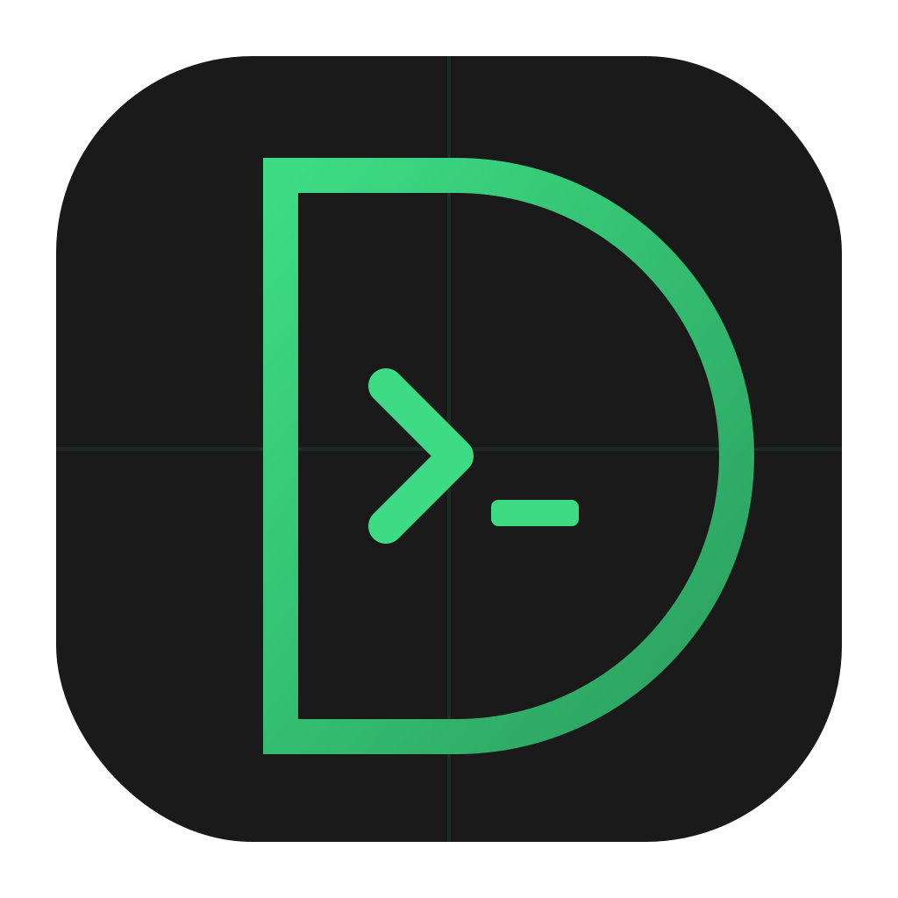
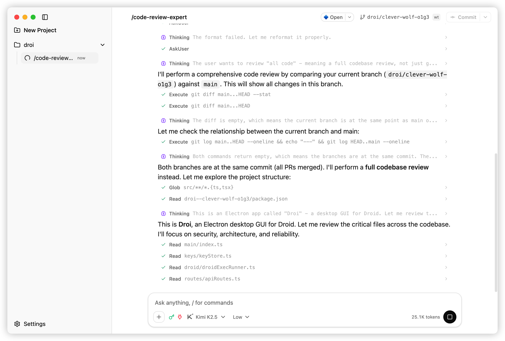

<p align="center">
  
</p>

# Droi

[](LICENSE)
[](https://www.typescriptlang.org/)
[](https://react.dev/)
[](https://www.electronjs.org/)

A desktop GUI application for [Droid CLI](https://docs.factory.ai), built with Electron + React + TypeScript. It provides an intuitive chat interface for easier interaction with AI assistants.



## Features

- **Multi-Model Support** - Switch between Claude, GPT, Gemini, and more
- **Persistent Sessions** - Stream JSON-RPC sessions via `droid exec` with auto-save to local files
- **Auto-Level Control** - Choose from default/low/medium/high autonomy levels
- **Real-time Streaming** - Live AI responses via JSON-RPC notifications
- **Permission Prompts** - Handle permission requests and user confirmations in the UI
- **API Key Rotation** - Manage multiple API keys with one-click switching
- **Web UI via LAN** - Access the app from other devices on your local network
- **Session Fingerprinting** - Sessions bound to API keys for secure isolation

## Installation

### Prerequisites

- Node.js 25+
- pnpm (recommended) or npm
- [Droid CLI](https://docs.factory.ai) installed and configured

### Quick Start

```bash
# Clone the repository
git clone <repository-url>
cd droi

# Install dependencies
pnpm install

# Set API Key (optional, can also be set in-app)
export FACTORY_API_KEY=fk-...

# Start development mode
pnpm dev
```

## Development

```bash
# Standard development mode
pnpm dev

# Development with Web UI + HMR (enables LAN access)
# - Renderer runs on Vite dev server (default http://localhost:5173)
# - API server runs on port 3001, Web UI accessible from LAN
pnpm dev:mobile

# Start API server only
pnpm dev:api

# Type checking
pnpm typecheck

# Run tests
pnpm test

# Build production version
pnpm build
```

### Build Desktop Apps

```bash
# macOS
pnpm build:mac

# Windows
pnpm build:win

# Linux
pnpm build:linux
```

## Web UI via LAN

Droi can expose a local HTTP server, allowing you to access the app from other devices on your local network (including phones).

> Security Note: **Devices on your LAN have full control** (same capabilities as desktop UI, including running `/api/exec` and changing settings).

### Enable Web UI

```bash
# Enable HTTP server + Web UI
export DROID_WEB_ENABLED=true

# Configure server bind address and port
export DROID_APP_API_HOST=0.0.0.0
export DROID_APP_API_PORT=3001

# Start with Web UI enabled
pnpm dev:mobile
```

Then open `http://<your-lan-ip>:3001` on any device in the same network.

## Environment Variables

| Variable | Description | Default |
|----------|-------------|---------|
| `FACTORY_API_KEY` | Factory API Key | - |
| `DROID_WEB_ENABLED` | Enable Web UI for LAN access | `true` |
| `DROID_APP_API_HOST` | API server bind address | `0.0.0.0` |
| `DROID_APP_API_PORT` | API server port | `3001` |
| `DROID_APP_DATA_DIR` | Data storage directory | Electron userData |
| `DROID_TRACE_CHAIN` | Enable chain debugging trace | `0` |

## Project Structure

```
src/
├── main/           # Electron main process and IPC handlers
├── preload/        # Secure bridge APIs exposed to renderer
├── renderer/       # React application
│   ├── components/ # UI components
│   ├── pages/      # Page components
│   ├── hooks/      # React Hooks
│   ├── state/      # State management
│   └── lib/        # Utility libraries
├── server/         # Local API server and mobile pairing endpoints
├── backend/        # Core application logic
│   ├── droid/      # Droid process management
│   ├── keys/       # API Key management
│   ├── git/        # Git integration
│   ├── storage/    # Storage layer
│   └── diagnostics/# Diagnostic tools
└── shared/         # Cross-process protocols and types
```

## Tech Stack

- **Electron 40** + **electron-vite 5** - Cross-platform desktop app framework
- **React 19** + **TypeScript 5.8** - Modern frontend development
- **Vite 7.3** + **TailwindCSS 4.1** - Fast builds and styling
- **TanStack Router** - Type-safe routing
- **TanStack Query** - Data fetching and caching
- **Zustand** - Lightweight state management
- **Hono** - Fast, lightweight backend framework

## Contributing

Issues and Pull Requests are welcome!

1. Fork this repository
2. Create your feature branch (`git checkout -b feature/AmazingFeature`)
3. Commit your changes (`git commit -m 'Add some AmazingFeature'`)
4. Push to the branch (`git push origin feature/AmazingFeature`)
5. Open a Pull Request

Please follow the [Conventional Commits](https://conventionalcommits.org/) specification for commit messages.

## Documentation

- [Droid Exec Protocol](./docs/droid-exec.md)
- [Droid Exec JSON-RPC Methods (Chinese)](./docs/droid-exec-jsonrpc-methods.zh-CN.md)
- [Building Apps with Exec](./docs/use-exec-build-app.md)

## License

[MIT](LICENSE) © 2026 kkkk2323

---

> This project is a third-party desktop client for [Factory](https://factory.ai) Droid CLI and is not officially affiliated with Factory.
