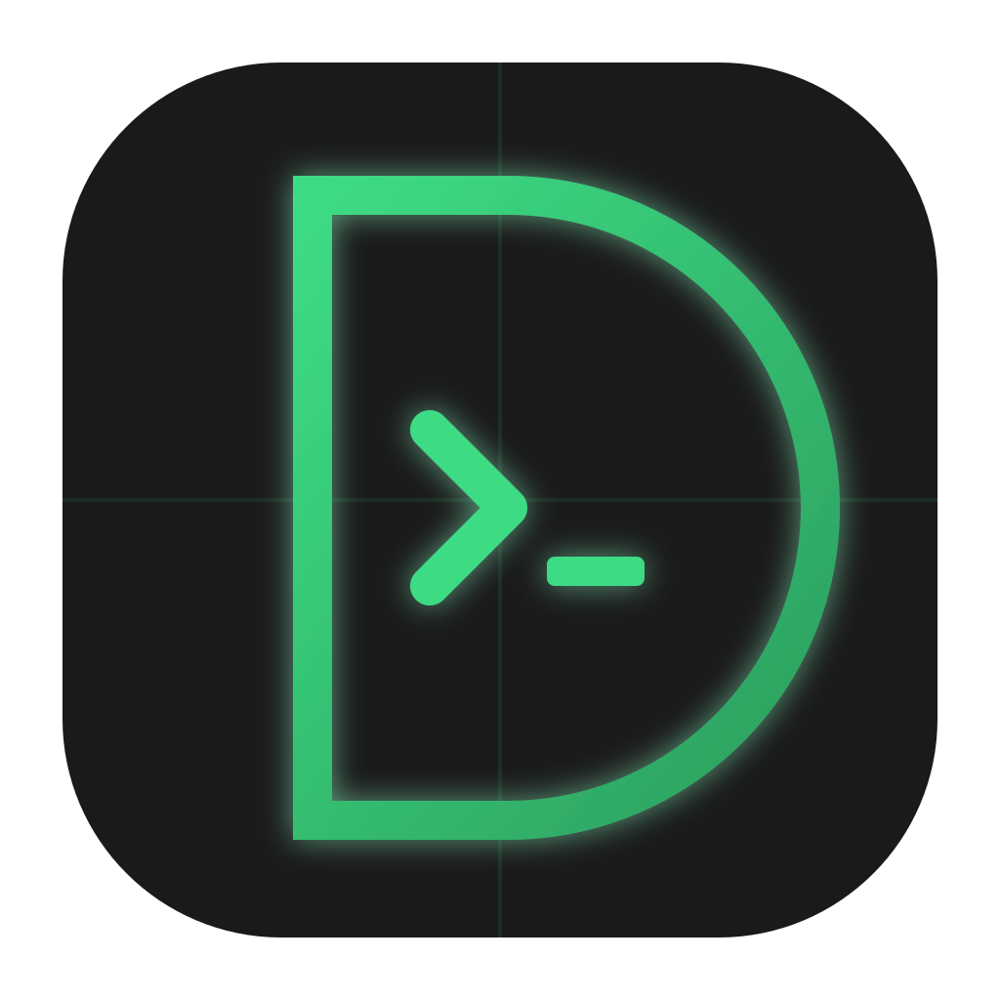
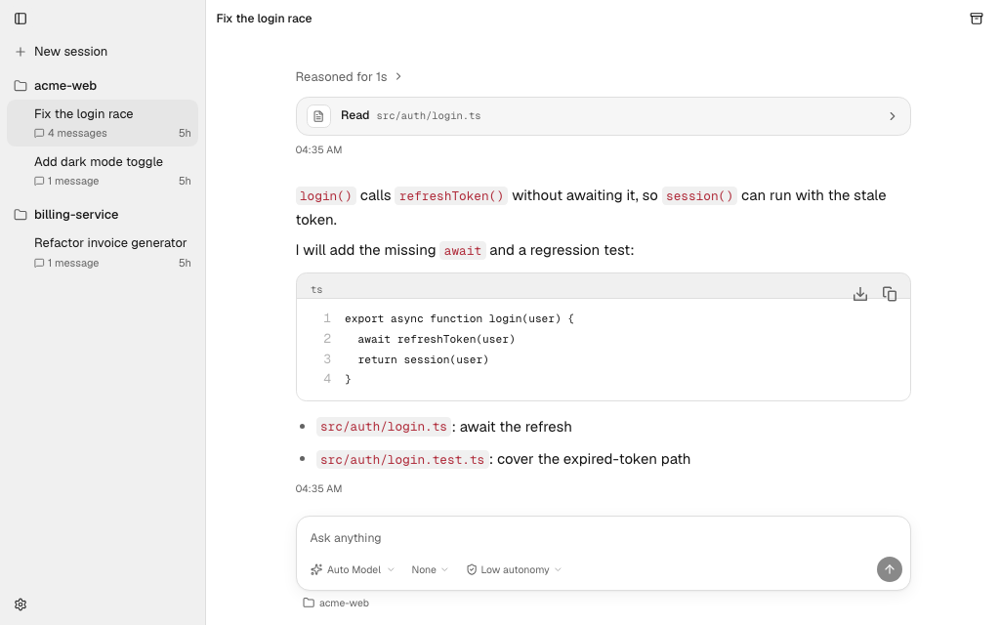

<p align="center">
  
</p>

# Droi

[](LICENSE)
[](https://www.typescriptlang.org/)
[](https://react.dev/)
[](https://www.electronjs.org/)

Droi is a desktop and mobile-web front end for the [Factory Droid](https://docs.factory.ai) coding agent. It does not run the agent itself: it starts `droid daemon` and presents the Daemon's Sessions in a fast, keyboard-friendly interface on your computer and, if you turn it on, on your phone.



## What it does

- **Every Session, one list** — the sidebar shows all Sessions the Daemon knows, grouped by Workspace, including ones started from the `droid` CLI.
- **Full transcripts** — user and assistant turns, tool calls with their results, and reasoning blocks, virtualised for long histories.
- **Live turns** — send a prompt, watch the reply stream, cancel mid-turn.
- **Prompts** — approve or deny tool permissions and answer the agent's questions; when a Session is open on the desktop and on a phone, both see the prompt and the first answer wins.
- **Per-Session settings** — model, reasoning effort and autonomy from the Daemon's own model list; rename and archive.
- **New Sessions** — from a recent Workspace or a typed path, also from a phone.
- **Phone access** — turn on Remote Access, scan the QR code, add Droi to your home screen. The phone talks to a Gateway on your computer; your Factory credentials never leave it.
- **Local proxy support** — point the Daemon at a Factory API base URL such as a local `droid-proxy`.

## How it fits together

```
phone browser ──┐
                ├── Gateway (Desktop Shell) ── droid daemon (loopback)
desktop window ─┘        │
                    Pairing Token check, credential injection
```

- **Daemon**: `droid daemon`, started and supervised by the Desktop Shell. Owns every Session.
- **Desktop Shell**: the Electron app. Starts the Daemon, hosts the Gateway, opens the window. Holds no conversation state.
- **Gateway**: checks the Pairing Token at the WebSocket upgrade, swaps in your Factory login token (or an API key), forwards everything else verbatim. Listens on loopback; on LAN interfaces only while Remote Access is on.
- **Client**: one React app served by the Gateway; the same bundle runs in the desktop window and on the phone.

The vocabulary is in [CONTEXT.md](./CONTEXT.md); the decisions are in [docs/adr](./docs/adr).

## Requirements

- [Droid CLI](https://docs.factory.ai) installed (`droid` on PATH or in `~/.local/bin`, or set the path in Settings)
- `droid login` done on this computer (the Daemon runs as that login); Droi signs in with the same account
- Node.js 24+ and pnpm for development

## Getting started

```bash
pnpm install
pnpm dev            # opens the Desktop Shell
```

Open **Settings** (gear icon) → **Account** → **Sign in** (the same device-code login as `droid login`). Optionally set a Factory API base URL under **Daemon** (for example a local `droid-proxy`, which then rotates keys for the LLM calls), and turn on **Remote Access** to pair a phone.

A Factory API key (Settings → Daemon, or `FACTORY_API_KEY`) works as a fallback when you are not signed in; `FACTORY_API_BASE_URL` in the environment is honoured too.

## Development

| Command | What it does |
|---------|--------------|
| `pnpm dev` | Desktop Shell with hot reload |
| `pnpm dev:client` | Client alone in a browser (vite) |
| `pnpm check` | format check, lint, typecheck |
| `pnpm test` | unit tests (vitest) |
| `pnpm test:e2e` | Playwright: Client against the Fake Daemon, desktop and phone viewports |
| `pnpm test:smoke` | Playwright: the built Desktop Shell (`pnpm build` first) |
| `pnpm test:live` | one case against a real Daemon; runs only with `FACTORY_API_KEY` |
| `pnpm build` / `pnpm build:mac` | production build / macOS DMG |

The E2E suite never needs a Factory key: it drives the real Client against a scripted Fake Daemon that validates its own messages with the SDK's schemas (see [ADR 0002](./docs/adr/0002-e2e-tests-run-the-client-against-a-fake-daemon.md)).

## Project structure

```
src/main/       Desktop Shell: Daemon supervisor, Gateway, settings, IPC
src/preload/    minimal bridge (Gateway URL, window token, settings calls)
src/renderer/   Client (React)
src/shared/     contracts shared by Shell and Client
e2e/            Playwright + Fake Daemon
e2e-electron/   Desktop Shell smoke suite
e2e-live/       live test
docs/adr/       architecture decisions
```

## License

MIT
