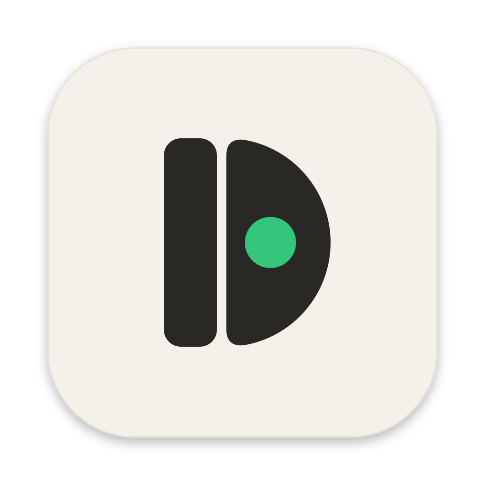
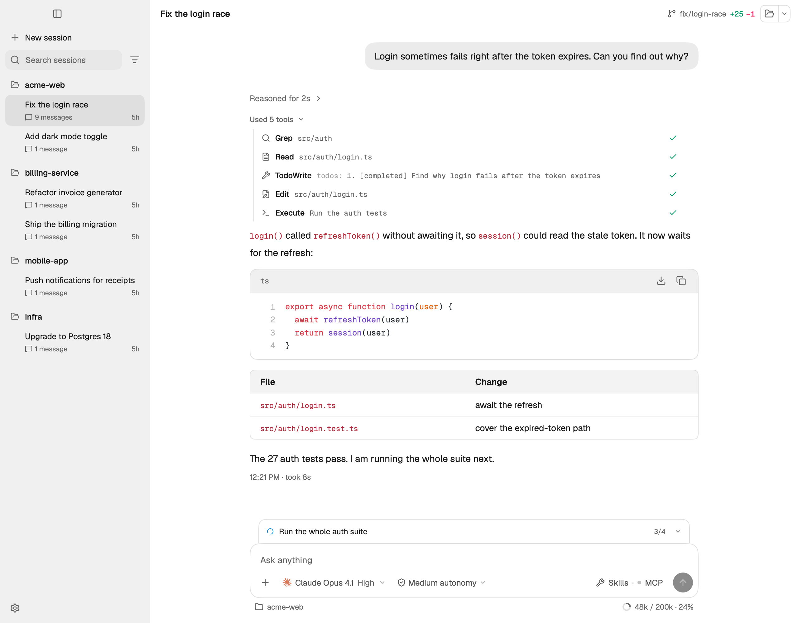

<p align="center">
  
</p>

# Droi

[](LICENSE)
[](https://go.dev/)
[](https://mygo.egoist.dev)
[](https://expo.dev/)

A native Mac and iPhone app for the [Factory Droid](https://docs.factory.ai) coding agent.



## What it does

- **Every Session, one list**: all the Sessions the Daemon knows, grouped by Workspace, with search and sorting, including Sessions started from the `droid` CLI.
- **Full transcripts**: your messages, Droid's replies with code and tables, reasoning, tool calls with their results, Scripts, subagents and the task list.
- **Live turns**: watch the reply stream, queue the next message while Droid works (⌘↩ hands it to the running turn), cancel at any time.
- **Prompts**: allow or deny a tool call and answer Droid's questions. When a Session is open on the Mac and on the phone, both show the prompt and the first answer wins.
- **Per-Session settings**: model, reasoning effort, autonomy and tool mode (Direct, Both, Script), from the Daemon's own model list.
- **New Sessions**: in a recent Workspace, another folder, or a new folder of its own; paste or drop images into the message.
- **Around the Session**: slash commands, Skills and MCP Servers, the Workspace's Git changes, and "Open in" Finder or your editor.
- **Memory**: Droi keeps what Droid learns about you and your Workspaces (conventions, tool quirks, past failures) and gives it back in later Sessions.
- **Phone access**: turn on Remote Access, scan the QR code with the Phone App. The phone talks to the Gateway on your Mac; your Factory credentials never leave it.
- **Alerts**: a sound, a notification and an unread mark when a Session finishes or waits for you.
- **Updates itself**: it checks every hour, downloads only what changed, checks the signature, and restarts once no Session is working.
- **Local proxy support**: point the Daemon at a Factory API base URL such as a local `droid-proxy`.

## Performance

The Mac app is written in Go on [MyGo](https://mygo.egoist.dev)'s native UI, with no Electron and no webview. Compared with the Electron app it replaces, on our test Mac:

| | Native | Electron |
|---|---|---|
| Launch to the Session list | 0.95 s | 2.9 s |
| Memory when idle | 103 MB | 526 MB |

How we measured: [apps/native/docs/performance.md](./apps/native/docs/performance.md).

## Requirements

- macOS (one app for Apple silicon and Intel)
- The [Droid CLI](https://docs.factory.ai) (`droid` on PATH or in `~/.local/bin`)
- `droid login` done on this Mac: the Daemon runs as that login, and Droi signs in with the same account

## Install

Download `Droi <version>.dmg` from the [latest Release](https://github.com/kkkk2323/droi/releases/latest) and drag Droi into Applications. The app is not signed with an Apple Developer certificate, so if macOS refuses to open it, run:

```bash
xattr -cr /Applications/Droi.app
```

Then open **Settings** (gear icon) → **Account** → **Sign in**, the same device-code login as `droid login`. Under **Advanced** you can set a Factory API base URL (a local `droid-proxy`, say). A Factory API key works as a fallback when you are not signed in, and `FACTORY_API_KEY` and `FACTORY_API_BASE_URL` in the environment are honoured too.

Droi keeps its settings, Memory and the Pairing Token in `~/Library/Application Support/Droi`, readable only by your user. It replaces the old Electron app in place: same bundle identifier and data folder, so your settings and paired phones carry over.

### The Phone App

The iPhone Client is built from source and installed on a connected iPhone with Xcode: `pnpm install:phone`. Then turn on **Settings → Remote Access** on the Mac and scan the QR code with the Phone App. See [apps/mobile/DEVICE-CHECKLIST.md](./apps/mobile/DEVICE-CHECKLIST.md) for what to try on the device.

## How it fits together

```
Droi window (Go) ── Go SDK ──────────────────────────┐
                                                        ├── droid daemon (loopback)
Phone App ── Gateway (Pairing Token check, credential) ─┘
```

- **Daemon**: `droid daemon`. It owns every Session, its transcript and all file and Git work.
- **Host**: inside the Mac app. It starts and watches the Daemon, supplies the Factory credential, runs the Gateway and keeps Memory.
- **Desktop Shell**: the Mac app itself. Its window is a Client that talks to the Daemon directly through `packages/droid-sdk-go` and holds no conversation state.
- **Gateway**: lets a Remote Client reach the Daemon. It checks the Pairing Token and adds your Factory credential, so the credential never leaves the Mac. It listens on your network only while Remote Access is on.
- **Phone App**: the iPhone Client (Expo), a Remote Client through the Gateway.

The vocabulary is in [CONTEXT.md](./CONTEXT.md); the decisions are in [docs/adr](./docs/adr). How releases and in-app updates work: [apps/native/docs/releases.md](./apps/native/docs/releases.md).

## Development

Run these from the repository root.

| Command | What it does |
|---------|--------------|
| `go run ./apps/native` | run the Mac app (needs `droid` on PATH) |
| `go test ./apps/native/... ./packages/droid-sdk-go/...` | unit tests, and view tests that draw the app against the Fake Daemon |
| `go tool -modfile=apps/native/go.mod mygo build apps/native` | build `Droi.app` and the DMG into `apps/native/build` |
| `pnpm check` | format check, lint and typecheck of the TypeScript packages |
| `pnpm test` | unit tests (vitest) |
| `pnpm test:e2e:phone` | Playwright: the Phone App's web build against the Fake Daemon |
| `pnpm install:phone` | build a signed Release of the Phone App and install it on the connected iPhone |
| `pnpm test:live` | one case against a real Daemon; runs only with `FACTORY_API_KEY` |

The tests never need a Factory key: they run the real Clients against a scripted Fake Daemon that checks its own messages with the SDK's schemas (see [ADR 0002](./docs/adr/0002-e2e-tests-run-the-client-against-a-fake-daemon.md)). The screenshot in this README comes from the Fake Daemon too:

```bash
DROI_README_SHOTS=1 go test ./apps/native/internal/app -run TestReadmeScreenshots
```

More on the Mac app (its layout, how it matches the Electron app, how to re-record the reference screens) is in [apps/native/README.md](./apps/native/README.md).

## Project structure

```
apps/native/                 the Mac app: Go on MyGo (Host, Gateway, Memory, the window)
apps/mobile/                 the Phone App (Expo SDK 57, iPhone)
apps/desktop/                the former Electron app; its package.json carries the release version
packages/droid-sdk-go/       the Go SDK for the Daemon protocol, and the Fake Daemon for Go tests
packages/daemon-layer/       the TypeScript daemon layer the Phone App uses
tests/fake-daemon/           the scripted Fake Daemon
tests/mobile/                Playwright: the Phone App's web build against the Fake Daemon
tests/live/                  live test
docs/adr/                    architecture decisions
```

## License

MIT
